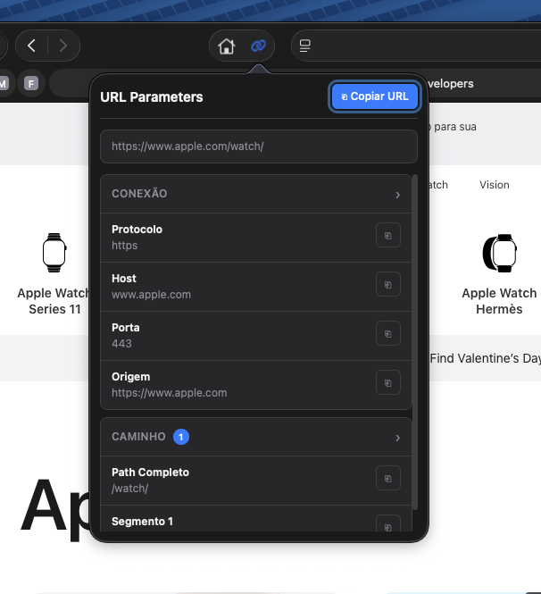

# URL Parameters - Extensión Safari

*Lee esto en otros idiomas: [English](README.md), [Português](README.pt-br.md)*

Una extensión de Safari que analiza la URL de la pestaña actual, mostrando sus componentes de forma organizada con la opción de copiar cada elemento al portapapeles.



## Características

- **Análisis completo de URL**: Muestra todos los componentes de la URL de forma organizada
  - Protocolo (http, https, etc.)
  - Host/Dominio
  - Puerto
  - Ruta y segmentos
  - Query strings (parámetros GET)
  - Fragmentos (hash)
  - Autenticación (cuando está presente)

- **Decodificación automática**: Los valores codificados en URL se decodifican y muestran automáticamente

- **Copiar al portapapeles**: Cada elemento tiene un botón para copiar su valor

- **Interfaz nativa**: Diseño que sigue el estilo visual de macOS/Safari, con soporte para modo oscuro

## Instalación

### Prerequisitos

- macOS 11.0 o superior
- Xcode 12.0 o superior
- Safari 14.0 o superior

### Paso a Paso

1. **Preparar Xcode (primera vez)**

   Si es la primera vez que usas Xcode o después de una actualización, ejecuta:

   ```bash
   xcodebuild -runFirstLaunch
   ```

2. **Convertir a proyecto Xcode**

   Navega a la carpeta del proyecto y ejecuta:

   ```bash
   cd url-parameters
   xcrun safari-web-extension-converter . --project-location ../ --app-name "URL Parameters" --bundle-identifier com.tudominio.urlparameters
   ```

   Este comando creará un proyecto Xcode en la carpeta padre con la estructura necesaria para una extensión web de Safari.

3. **Abrir en Xcode**

   ```bash
   open "../URL Parameters/URL Parameters.xcodeproj"
   ```

4. **Configurar el proyecto**

   - Haz clic en el proyecto "URL Parameters" en el panel izquierdo (icono azul)
   - Selecciona el target "URL Parameters"
   - Ve a la pestaña "Signing & Capabilities"
   - En "Team", selecciona tu Apple ID (o añade una cuenta)
   - Repite para el target "URL Parameters Extension"

5. **Compilar y ejecutar**

   - Presiona `Cmd + R` para compilar y ejecutar
   - La app se instalará y podrás habilitar la extensión en Safari

6. **Habilitar en Safari**

   - Abre Safari → Ajustes → Extensiones
   - Marca la casilla "URL Parameters"
   - Permite la extensión en todos los sitios o en los sitios deseados

### Modo Desarrollador (para pruebas)

Si quieres probar sin firmar con Apple ID:

1. Safari → Ajustes → Avanzado → Mostrar menú Desarrollador
2. Desarrollador → Permitir extensiones sin firmar
3. Recompila el proyecto en Xcode

## Estructura del Proyecto

```
url-parameters/
├── manifest.json              # Configuración de la extensión
├── background.js              # Script de background
├── popup/
│   ├── popup.html            # Interfaz del popup
│   ├── popup.css             # Estilos (con soporte para modo oscuro)
│   └── popup.js              # Lógica de análisis de URL
├── icons/
│   ├── icon.svg              # Icono fuente (SVG) - modo claro
│   ├── icon-dark.svg         # Icono fuente (SVG) - modo oscuro
│   ├── icon-16.png           # Iconos en varios tamaños
│   ├── icon-32.png
│   ├── icon-48.png
│   ├── icon-96.png
│   ├── icon-128.png
│   ├── icon-256.png
│   ├── icon-512.png
│   ├── icon-*-dark.png       # Iconos modo oscuro
│   └── generate-icons.sh     # Script para regenerar iconos
├── update-xcode-icons.sh     # Script para actualizar iconos en Xcode
└── README.md
```

## Uso

1. Navega a cualquier página en Safari
2. Haz clic en el icono de la extensión en la barra de herramientas
3. Ve la URL desglosada en sus partes
4. Haz clic en el botón de copiar (⎘) para copiar cualquier valor
5. Usa el botón "Copiar URL" para copiar la URL completa

## Ejemplos

Para una URL como:
```
https://example.com:8080/api/users?name=Jo%C3%A3o&age=30#section1
```

La extensión mostrará:

| Componente | Valor |
|------------|-------|
| Protocolo | https |
| Host | example.com |
| Puerto | 8080 |
| Path | /api/users |
| Segmento 1 | api |
| Segmento 2 | users |
| name | João (decodificado de Jo%C3%A3o) |
| age | 30 |
| Hash | section1 |

## Desarrollo

### Regenerar Iconos

Si modificas el icono SVG, regenera los PNG:

```bash
cd icons
./generate-icons.sh
```

Para instalar la herramienta de conversión (opcional, mejora la calidad):

```bash
brew install librsvg
```

### Actualizar Iconos en Xcode

Después de regenerar los iconos, actualízalos en el proyecto Xcode:

```bash
./update-xcode-icons.sh
```

### Probar Cambios

Después de hacer cambios en los archivos web (HTML, CSS, JS):

1. En Xcode, limpia el build: `Cmd + Shift + K`
2. Recompila: `Cmd + R`
3. Si es necesario, deshabilita y vuelve a habilitar la extensión en Safari

### Solución de Problemas

**Error "A required plugin failed to load":**
```bash
xcodebuild -runFirstLaunch
```

**La extensión no aparece en Safari:**
1. Verifica que la app esté corriendo (aparece en el Dock)
2. Ve a Safari → Ajustes → Extensiones y habilítala

**El icono no se actualiza:**
1. Limpia el build en Xcode (`Cmd + Shift + K`)
2. Elimina la app en ~/Library/Containers/
3. Recompila

## Licencia

MIT License - siéntete libre de usar y modificar.

## Contribuciones

¡Las contribuciones son bienvenidas! Abre un issue o pull request.
